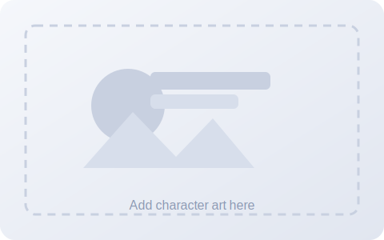

# Template Character

  

    
    
Character artwork placeholder.

  

  

    

      
<strong>Name:</strong> Character Name

      
<strong>Version:</strong> Version Label

      
<strong>Origin:</strong> Origin Source

      
<strong>Roles:</strong> <a class="ua-role-link" data-role="role-<slug>" href="#">Role Name</a>, <a class="ua-role-link" data-role="role-<slug>" href="#">Role Name</a>

      
<strong>Difficulty:</strong> Low / Medium / High

      
<strong>Gameplan:</strong> One paragraph describing how the character plays.

    

  

## Innates

  
Innate Name

  
Concise innate effect description.

## Keywords

  
<a class="ua-keyword-link" data-keyword="keyword-<slug-1>" href="#">Keyword 1</a>

  
Keyword 1 details or limits.

  
<a class="ua-keyword-link" data-keyword="keyword-<slug-2>" href="#">Keyword 2</a>

  
Keyword 2 details or limits.

## Status Effects

  
<a class="ua-status-link" data-status="status-<slug>" href="#">Status name</a>

  
Optional per-character notes (limits, triggers, etc.).

## Terminology

  
<a class="ua-term-link" data-term="term-<slug>" href="#">Term</a>

## Cards

Use timing labels in the standard order (On Play -> Before Clash -> After Clash -> Before Use -> On Use -> On Hit -> After Use -> Always). Start each sentence with the timing label. Use `?` for optional effects and `:` for mandatory costs; place keyword-only lines where they resolve (pre-play first, After Clash after Shield/damage, After Use after On Hit, cleanup keywords last).

### Card 1: Card Name

  

    <strong>Cost:</strong> Value
    <strong>Power:</strong> Value
    <strong>Type:</strong> Basic, Tags
    <strong>Target:</strong> Self / Allies / Enemies
    <strong>Speed:</strong> Value
  

  
Effect

  
On Use: Effect description.

  
<strong>Conditional:</strong> Conditional text (if any).

### Card 2: Card Name

  

    <strong>Cost:</strong> Value
    <strong>Power:</strong> Value
    <strong>Type:</strong> Basic, Tags
    <strong>Target:</strong> Self / Allies / Enemies
    <strong>Speed:</strong> Value
  

  
Effect

  
On Use: Effect description.

  
<strong>Conditional:</strong> Conditional text (if any).

### Card 3: Card Name

  

    <strong>Cost:</strong> Value
    <strong>Power:</strong> Value
    <strong>Type:</strong> Technique, Tags
    <strong>Target:</strong> Self / Allies / Enemies
    <strong>Speed:</strong> Value
  

  
Effect

  
On Use: Effect description.

  
<strong>Conditional:</strong> Conditional text (if any).

### Card 4: Card Name

  

    <strong>Cost:</strong> Value
    <strong>Power:</strong> Value
    <strong>Type:</strong> Technique, Tags
    <strong>Target:</strong> Self / Allies / Enemies
    <strong>Speed:</strong> Value
  

  
Effect

  
On Use: Effect description.

  
<strong>Conditional:</strong> Conditional text (if any).

### Card 5: Card Name

  

    <strong>Cost:</strong> Value
    <strong>Power:</strong> Value
    <strong>Type:</strong> Technique, Tags
    <strong>Target:</strong> Self / Allies / Enemies
    <strong>Speed:</strong> Value
  

  
Effect

  
On Use: Effect description.

  
<strong>Conditional:</strong> Conditional text (if any).

### Ultimate: Ultimate Name

  

    <strong>Cost:</strong> Value
    <strong>Power:</strong> Value
    <strong>Type:</strong> Ultimate, Tags
    <strong>Target:</strong> Self / Allies / Enemies
    <strong>Speed:</strong> Value
  

  
Effect

  
On Use: Effect description.

  
<strong>Conditional:</strong> Conditional text (if any).

